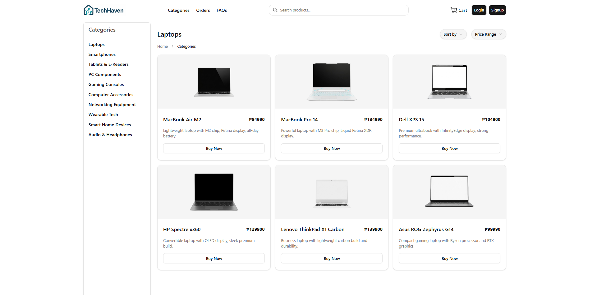
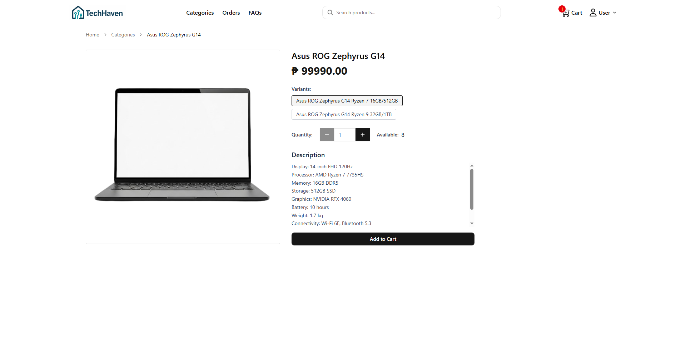

# Live Link:

## https://techhaven-project.vercel.app/

# 🛒 Ecommerce App

A full-stack **E-commerce platform** built with modern web technologies. This project includes a **Node.js + Express + MySQL backend** and a **React + Vite + Tailwind frontend**.

It showcases real-world e-commerce features: authentication, product & variant management, shopping cart, checkout flow, and an admin dashboard.

---

## 🚀 Features

👤 User Features

- Authentication & Authorization (JWT, bcrypt, cookies)
- Browse Products & Variants (view details, images from Cloudinary)
- Shopping Cart & Checkout (secure payments with Stripe)
- Categories & Filtering (sort by newest/oldest, filter variants by options)

🛠️ Admin Features

- Admin Dashboard (overview of products, categories, orders, users)
- Product & Variant Management (CRUD with images via Cloudinary)
- Category Management (create, update, delete, filter options)
- Order Management (view and update order status)
- User Management (manage registered users, roles)

---

## 🛠️ Tech Stack

### **Frontend**

- React 19 + Vite
- React Router v7
- React Hook Form + Zod
- Tailwind CSS + shadcn/ui + Radix UI
- Motion One animations
- Stripe Checkout integration
- TanStack Query + React Table

### **Backend**

- Node.js + Express 5
- TypeScript + ts-node-dev
- MySQL2
- JWT Authentication
- Bcrypt password hashing
- Cloudinary + Multer (image upload)
- Stripe payments
- Zod validation
- Jest + Supertest (testing)

---

## ⚙️ Installation

### 1. Clone the repository

```bash
git clone https://github.com/Jeonjown/ecommerce-app.git
cd ecommerce-app
```

### 2. Setup Backend

```bash
cd backend
npm install
```

Create `.env` file in `backend/`:

```env
PORT=5000
DB_HOST=localhost
DB_USER=root
DB_PASSWORD=yourpassword
DB_NAME=ecommerce_db
JWT_SECRET=yourjwtsecret
STRIPE_SECRET_KEY=your_stripe_key
CLOUDINARY_CLOUD_NAME=your_cloud_name
CLOUDINARY_API_KEY=your_api_key
CLOUDINARY_API_SECRET=your_api_secret
```

Run database seed (optional):

```bash
npm run seed
```

Start backend server:

```bash
npm run dev
```

### 3. Setup Frontend

```bash
cd ../frontend
npm install
npm run dev
```

---

## 📖 Scripts

### Backend

- `npm run dev` – Start dev server with ts-node-dev
- `npm run build` – Compile TypeScript
- `npm run start` – Run compiled build
- `npm run seed` – Seed database
- `npm run test` – Run Jest tests

### Frontend

- `npm run dev` – Start Vite dev server
- `npm run build` – Build production frontend
- `npm run preview` – Preview production build
- `npm run lint` – Run ESLint

---

## 📷 Screenshots




